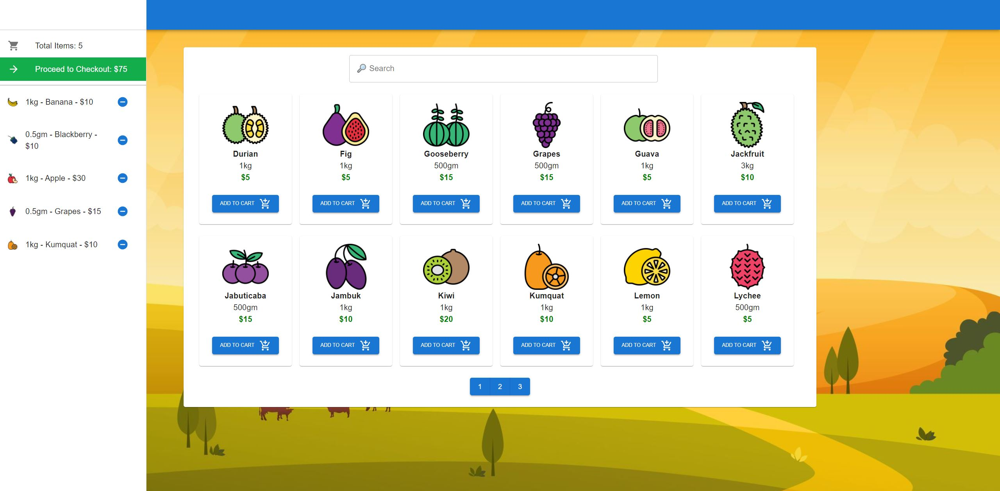

<h3>Redux E-commerce Website (🔨 In Progress 🔨)</h3>
<h3>Link to project (front-end only): https://objective-fermat-dfd74b.netlify.app/</h3>

<h4>This project is my first exposure in using Redux for a project. The backend (NodeJS) is currently in the works with payment methods using stripe.</h4>

<h4>New things learnt so far: 
  <ul><li>Basics of Redux</li><li>Using Redux with Async programming</li><li>Integrating Redux with React</li><li>Using Redux dev tools</li><li>Redux toolkit</li></ul>
</h4>

